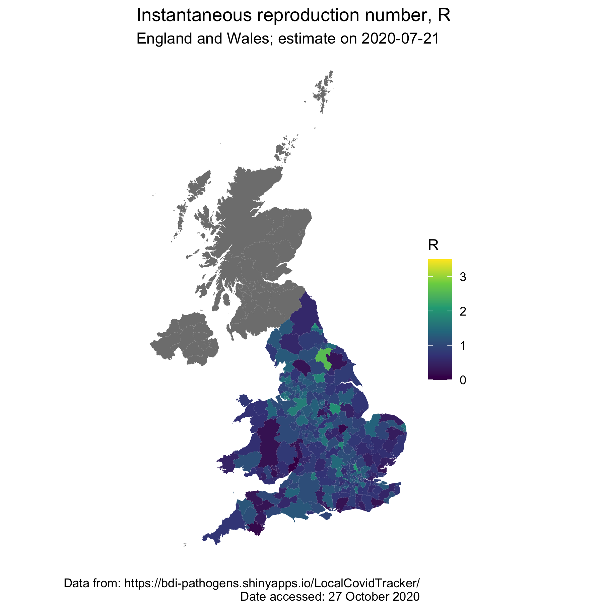

`covid19_r_map_ew`
-----------------

R code for creating a map of R(t) for England and Wales using data from [LocalCovidTracker](https://bdi-pathogens.shinyapps.io/LocalCovidTracker/).  


### Data requirements

Two datasets are required to run this script: shapefiles of the UK and estimates of R(t).  

* Estimates of R(t) by Lower Tier Local Authority (LTLA) are available from [LocalCovidTracker](https://bdi-pathogens.shinyapps.io/LocalCovidTracker/).  Within the "Daily tracker" tab, adjust the date range to include the date of interest and select "Lower Tier Local Authority" from the "Area type of interest" drop down menu, and click "Download CSV" on the "Instantaneous reproduction number" panel.  The downloaded filename should be of the form `estimated.R.ltlas.*.csv` when downloaded from the Shiny App.  This file should be placed within the folder `data/raw` and it's full name should be updated within the `Makefile` (the `localcovidtracker_filename` variable).  
* Shapefiles of the UK with 2019 Local Authority District codes are available from the [ONS](https://geoportal.statistics.gov.uk/datasets/3a4fa2ce68f642e399b4de07643eeed3_0).  Download the "Shapefiles" from this website and put the uncompressed folder within `data/raw` of this repository.  The uncompressed folder name should be called `Local_Authority_Districts__December_2019__Boundaries_UK_BUC-shp` and should include five different files.  


### Software requirements

* The R scripts within this repository require the following packages: `rgdal, broom, tidyverse, ggplot2`.  


### Usage


* Once downloaded, the following command wil clean both the R(t) and Shapefile data and produce a map for the date specified.  
```
make r_date="2020-04-23" map
```

* Simply calling `make map` will produce a map for for 21st July 2020 (`2020-07-21`) by default.  
* Dates can also be specified by day after 31st Dec 2019 (such that 1 is 1st day of the year of 2020): `make r_date=4 map`.  


### Additional commands

* `make data_covid19` will clean the R(t) COVID19 data (automatically called by `make map`).  
* `make data_shapefile` will clean the Shapefile (automatically called by `make map`).  Within this project, this script simply moves the shapefiles to the `data/processed` folder but can include more elaborate scripts to simplify the shapefiles if necessary.  


### Output

Example output from calling `make map` is the following file that is produced in `output/figures`.  


